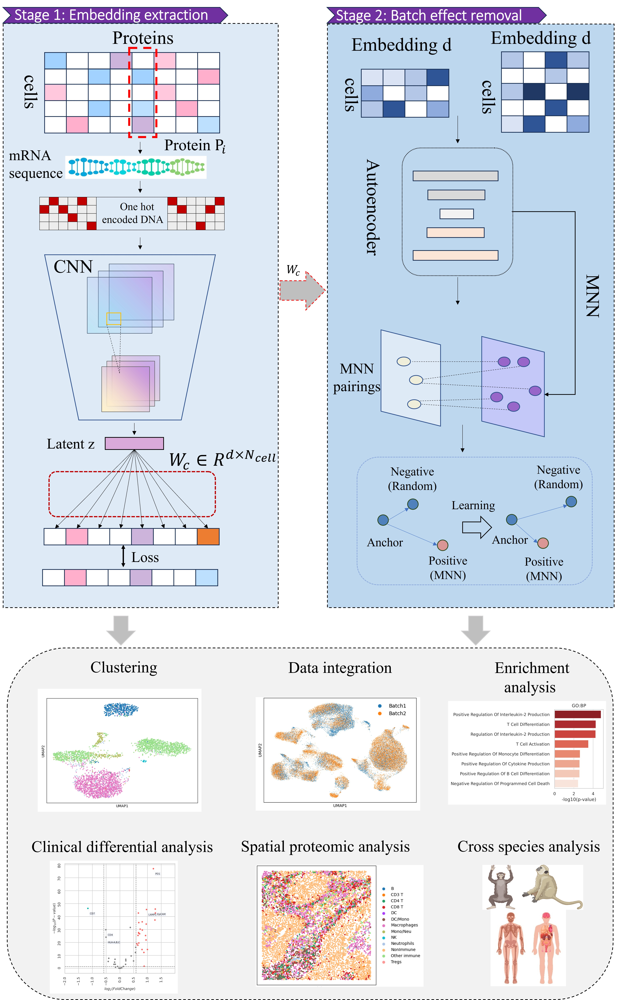

 We propose a novel method SANPRO

# SANPRO

The official implementation for "**SANPRO**".

**Table of Contents**

* [Datasets](#Datasets)
* [Installation](#Installation)
* [Usage](#Usage)

## Datasets

We provide some data demos in the fold named "data_demo". The complete dataset can be downloaded via the download link provided in the paper.

## Installation

To reproduce **SANPRO**, we suggest first create a conda environment by:

~~~shell
conda create -n SANPRO python=3.8
conda activate SANPRO
~~~

and then run the following code to install the required package:

~~~shell
pip install -r requirements.txt
~~~

and then install [PyG](https://pytorch-geometric.readthedocs.io/en/latest/install/installation.html) according to the CUDA version, take torch-1.13.1+cu117 (Ubuntu 20.04.4 LTS) as an example:

~~~shell
pip install torch_geometric
pip install pyg_lib torch_scatter torch_sparse torch_cluster torch_spline_conv -f https://data.pyg.org/whl/torch-1.13.1+cu117.html
~~~

## Usage

### Data preprocessing

In order to run **SANPRO**, we need to first create anndata from the raw data.

The h5ad file should have cells as obs and peaks as var. There should be at least three columns in `var`:  `chr`, `start`, `end` that indicate the genomic region of each peak. The h5ad file should also contain two columns in the `obs`: `Batch` and `CellType` （reference data）, where `Batch` is used to distinguish between reference and query data, and `CellType` indicates the true label of the cell.

### Stage 1: embeddings extraction

The processed data are used as input to *scbasset* and a reference genome is provided to extract the embedding incorporating sequence information: 

~~~shell
# Stage 1: embeddings extraction

python train_demo.py
~~~

### Stage 2: batch effect removal

~~~shell
# Stage 2: batch effect removal

python remove_batch_demo.py 
~~~

